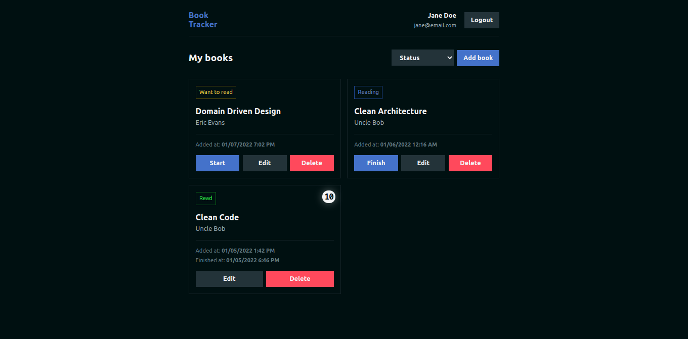

<h1 align="center">Book Tracker</h1>
<h4 align="center">The Book Tracker is a web app to help you track the book you're reading or want to read.</h4>

<p align="center">
  

  

  

  

  
</p>

<p align="center">
  <a href="#features">Features</a>&nbsp;&nbsp;&nbsp;|&nbsp;&nbsp;&nbsp;
  <a href="#installation">Installation</a>&nbsp;&nbsp;&nbsp;|&nbsp;&nbsp;&nbsp;
  <a href="#technologies">Technologies</a>&nbsp;&nbsp;&nbsp;|&nbsp;&nbsp;&nbsp;
  <a href="#license">License</a>
</p>

<p align="center">
  
</p>

## Features

- [x] Account creation
- [x] Login with email and password
- [x] List of all user books
- [x] List of all user books by status
- [x] Create new book
- [x] Update book status
- [x] Rate a book
- [x] Edit book info and rate
- [x] Delete a book

## ⚙ Instalação

To clone and run this application you need to have installed [Git](https://git-scm.com/) and [NodeJS](https://nodejs.org/en/download/) (which also installs the [npm](https://www.npmjs.com/)). Then in the command line:

```bash
# Clone repository
$ git clone https://github.com/marcosribeirodacunha/book-tracker-frontend.git

# Go into the folder
$ cd book-tracker-frontend

# Install all dependencies
$ npm install
// or yarn

# Run the application
$ npm run dev
// or yarn dev
```

**Important:** Before running the application you need to add the backend url in the `.env.local` file. Rename the `.env.example` to follow as example

## 👨🏽‍💻 Tecnologias

- [ReactJS](https://nextjs.org/)
- [NextJS](https://pt-br.reactjs.org/)
- [Typescript](https://www.typescriptlang.org/)
- [Axios](https://github.com/axios/axios)
- [ESlint](https://eslint.org/)
- [Prettier](https://prettier.io/)
- [EditorConfig](https://editorconfig.org/)

## License

This project is under the MIT license. See the [LICENSE](LICENSE) to more details.

This is a [Next.js](https://nextjs.org/) project bootstrapped with [`create-next-app`](https://github.com/vercel/next.js/tree/canary/packages/create-next-app).
